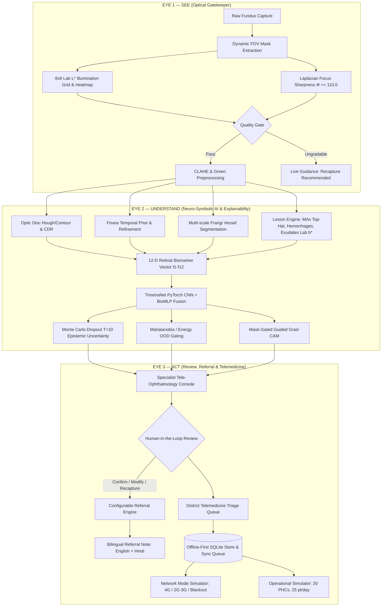

# Project Trinetra (त्रिनेत्र) — Walkthrough

## Distributed, Explainable Retinal Screening & Telemedicine Operational Engine
**SEE • UNDERSTAND • ACT**

Project Trinetra is built and operational as an end-to-end software prototype for retinal screening, explainable AI analysis, clinical review, referral management, and telemedicine operations.

---

## 1. Clinical Safety Positioning
Prominently integrated across all operational screens, reports, and clinical documents:
- **Primary Safety Declaration**: `Research / Demonstration Prototype — Not a Clinically Validated Diagnostic Device`
- **Macular Pathology Flag**: Explicitly reported as `Macular / DME Risk Flag` rather than claiming definitive OCT-level CSME/DME diagnosis.
- **Explainability Disclaimer**: `Highlighted regions contributed to the model's prediction and should be interpreted as AI evidence, not a standalone diagnosis.`

---

## 2. The Three-Eye Architecture

---

## 3. Implemented Modules & Architecture

### A. Backend (`backend/app/`)
1. **Configuration & Thresholds** ([`config.py`](file:///c:/Users/abhis/Desktop/Projects/SIH/TRI-Netra/backend/app/config.py)):
   - Focus threshold $\Phi = 110.0$, Illumination variation $\sigma_{max} = 18.0$, OOD threshold $\tau_{ood} = 4.20$, MC Dropout $T=10, p=0.20$, Calibration temperature $T=1.15$.
2. **Relational Database** ([`database.py`](file:///c:/Users/abhis/Desktop/Projects/SIH/TRI-Netra/backend/app/database.py)):
   - SQLite tables: `users`, `patients`, `screenings`, `eye_images`, `ai_results`, `biomarkers`, `clinical_reviews`, `referrals`, `sync_queue`, `audit_logs`, `devices`, `model_registry`.
3. **AI Core Modules** ([`backend/app/ai/`](file:///c:/Users/abhis/Desktop/Projects/SIH/TRI-Netra/backend/app/ai/)):
   - **Quality Gatekeeper** ([`quality.py`](file:///c:/Users/abhis/Desktop/Projects/SIH/TRI-Netra/backend/app/ai/quality.py)): Dynamic FOV aperture detection, 8×8 Lab $L^*$ grid heatmap, Tenengrad energy, and Laplacian focus score ($\Phi$).
   - **Retinal Preprocessing** ([`preprocessing.py`](file:///c:/Users/abhis/Desktop/Projects/SIH/TRI-Netra/backend/app/ai/preprocessing.py)): CLAHE enhancement in Lab $L^*$ space, green/red channel isolation, and frequency-domain homomorphic filtering ($\gamma_L=0.5, \gamma_H=1.5, D_0=30$).
   - **Anatomical Localization** ([`anatomy.py`](file:///c:/Users/abhis/Desktop/Projects/SIH/TRI-Netra/backend/app/ai/anatomy.py)): Optic disc localization & active contour segmentation, Cup-to-Disc Ratio (CDR), Fovea temporal prior ($\approx 2.5 \times D_{od}$) + local intensity minimum refinement, Multi-scale Hessian/Frangi vessel filter ($\sigma \in \{1, 2, 3\}$), morphological skeletonization, vessel density, branch density, and vessel tortuosity.
   - **Lesion Detection** ([`lesions.py`](file:///c:/Users/abhis/Desktop/Projects/SIH/TRI-Netra/backend/app/ai/lesions.py)): Microaneurysm inverted green morphological top-hat filtering outside vessels, blot/flame hemorrhage segmentation with 4-quadrant lesion dispersion, and hard exudates Lab $b^*$ clustering with foveal proximity calculation ($f_3$).
   - **12-D Biomarker Vector** ([`biomarkers.py`](file:///c:/Users/abhis/Desktop/Projects/SIH/TRI-Netra/backend/app/ai/biomarkers.py)): Computes and normalizes features $f_1$ through $f_{12}$ with stability checks and feature importance mapping.
   - **TrinetraNet PyTorch Architecture** ([`models.py`](file:///c:/Users/abhis/Desktop/Projects/SIH/TRI-Netra/backend/app/ai/models.py)): Residual convolutional blocks + 12-D Biomarker MLP branch + Confidence branch with neuro-symbolic concatenation and multi-task heads (DR grades 0–4, Macular risk, PDR evidence, Other abnormality).
   - **Uncertainty Engine** ([`uncertainty.py`](file:///c:/Users/abhis/Desktop/Projects/SIH/TRI-Netra/backend/app/ai/uncertainty.py)): Monte Carlo Dropout ($T=10$) computing predictive mean, predictive entropy, and epistemic uncertainty.
   - **Out-of-Distribution Gating** ([`ood.py`](file:///c:/Users/abhis/Desktop/Projects/SIH/TRI-Netra/backend/app/ai/ood.py)): Mahalanobis distance in neuro-symbolic feature space. If $\tau > 4.2$, sets `AI RESULT WITHHELD — Out of Distribution`.
   - **Explainability Engine** ([`explainability.py`](file:///c:/Users/abhis/Desktop/Projects/SIH/TRI-Netra/backend/app/ai/explainability.py)): PyTorch native Grad-CAM + Mask-Gated Guided Grad-CAM gating attention around verifiable lesions and anatomical structures.
   - **Procedural Fundus Generator** ([`generator.py`](file:///c:/Users/abhis/Desktop/Projects/SIH/TRI-Netra/backend/app/ai/generator.py)): Procedural clinical fundus synthesizer generating realistic choroidal textures, vascular bifurcations, optic disc, fovea, and ground-truth lesions for all 10 clinical benchmark scenarios.
4. **API Endpoints** ([`backend/app/routes/`](file:///c:/Users/abhis/Desktop/Projects/SIH/TRI-Netra/backend/app/routes/)):
   - `/auth`: RBAC login and instant role switcher (PHC Operator, Specialist, District Admin, ML Admin, Sysadmin).
   - `/patients` & `/screenings`: Patient registration, bilateral session tracking, live capture quality gate endpoint (`/screenings/quality-gate`).
   - `/ai`: Full image and bilateral screening analysis with layer persistence.
   - `/reviews`: Specialist human-in-the-loop decision console (`CONFIRM`, `MODIFY`, `REQUEST_RECAPTURE`, `ESCALATE`, `UNABLE_TO_ASSESS`) with audit logging.
   - `/referrals`: Configurable referral policy engine, structured bilingual referral note generator (English + Hindi), and printable HTML/PDF export.
   - `/telemedicine`: District triage queue with priority weighting.
   - `/sync`: Offline-first sync queue with network modes (Mode A: 4G, Mode B: 2G/3G, Mode C: Blackout).
   - `/simulation`: 20 PHCs, 25 pt/day Monte Carlo operational queue simulation.
   - `/validation`: AUROC, Sensitivity, Specificity, 5×5 Confusion Matrix, Calibration reliability curve, and error analysis.

---

### B. Frontend (`frontend/src/`)
1. **Design System** ([`index.css`](file:///c:/Users/abhis/Desktop/Projects/SIH/TRI-Netra/frontend/src/index.css)):
   - Clinical palette (deep slate, rich navy, clinical cyan/emerald, high-contrast alerts).
   - Modern typography (`Inter`, `Outfit`, `JetBrains Mono`).
   - Full support for **Dark Clinical Theme** (for retina review) and **Light Mode** (for operational screens).
2. **Internationalization** ([`translations.ts`](file:///c:/Users/abhis/Desktop/Projects/SIH/TRI-Netra/frontend/src/i18n/translations.ts)):
   - Full bilingual support in **English** and **Hindi (हिंदी)** for all operator workflows, capture guidance, clinical findings, and patient notification texts.
3. **Core Pages & Views**:
   - **Landing Page** ([`LandingPage.tsx`](file:///c:/Users/abhis/Desktop/Projects/SIH/TRI-Netra/frontend/src/pages/LandingPage.tsx)): Brand presentation, Three-Eye pillars, and 1-click launcher for the 10 Clinical Demonstration Cases.
   - **Dashboard** ([`DashboardPage.tsx`](file:///c:/Users/abhis/Desktop/Projects/SIH/TRI-Netra/frontend/src/pages/DashboardPage.tsx)): Daily screening statistics, system status telemetry, and recent sessions audit table.
   - **PHC Operator Screening Wizard** ([`OperatorWorkflow.tsx`](file:///c:/Users/abhis/Desktop/Projects/SIH/TRI-Netra/frontend/src/pages/OperatorWorkflow.tsx)): 6-step guided wizard (Registration $\to$ Right Eye $\to$ Left Eye $\to$ AI Execution $\to$ Clinical Summary $\to$ Submission).
   - **Smart Capture Assistant** ([`SmartCaptureAssistant.tsx`](file:///c:/Users/abhis/Desktop/Projects/SIH/TRI-Netra/frontend/src/components/SmartCaptureAssistant.tsx)): Live HUD guidance (Center Eye, Hold Steady, Too Dark, Blur Detected, Good Image).
   - **Specialist Review Console** ([`SpecialistReview.tsx`](file:///c:/Users/abhis/Desktop/Projects/SIH/TRI-Netra/frontend/src/pages/SpecialistReview.tsx)): Dominant image viewer with [`LayerViewer.tsx`](file:///c:/Users/abhis/Desktop/Projects/SIH/TRI-Netra/frontend/src/components/LayerViewer.tsx) (Raw RGB, Enhanced CLAHE, Vessels, Lesions, Grad-CAM, Side-by-side comparison, Opacity sliders) + [`TrustPanel.tsx`](file:///c:/Users/abhis/Desktop/Projects/SIH/TRI-Netra/frontend/src/components/TrustPanel.tsx) + [`WhyFlaggedModal.tsx`](file:///c:/Users/abhis/Desktop/Projects/SIH/TRI-Netra/frontend/src/components/WhyFlaggedModal.tsx) + Clinician override form.
   - **Telemedicine Queue** ([`TelemedicineQueue.tsx`](file:///c:/Users/abhis/Desktop/Projects/SIH/TRI-Netra/frontend/src/pages/TelemedicineQueue.tsx)): Prioritized triage list with emergency ranking.
   - **Referral Logistics** ([`ReferralManagement.tsx`](file:///c:/Users/abhis/Desktop/Projects/SIH/TRI-Netra/frontend/src/pages/ReferralManagement.tsx)): Tracking lifecycle, bilingual summary notes, and printable clinical PDF generator.
   - **Offline Sync Center** ([`OfflineSyncCenter.tsx`](file:///c:/Users/abhis/Desktop/Projects/SIH/TRI-Netra/frontend/src/pages/OfflineSyncCenter.tsx)): Network mode switcher (Mode A / B / C) and SQLite sync queue inspector.
   - **Operations Simulator** ([`SimulationCenter.tsx`](file:///c:/Users/abhis/Desktop/Projects/SIH/TRI-Netra/frontend/src/pages/SimulationCenter.tsx)): 20 PHCs, 25 pt/day Monte Carlo queue modeling with hourly arrival histograms.
   - **Validation Center** ([`ValidationCenter.tsx`](file:///c:/Users/abhis/Desktop/Projects/SIH/TRI-Netra/frontend/src/pages/ValidationCenter.tsx)): 5×5 Confusion Matrix, Calibration reliability curve, and error analysis.

---

## 4. Verification Results

### A. Automated AI Pipeline Unit Tests (`tests/test_pipeline.py`)
- `test_optical_gatekeeper`: **PASSED** (Validated sharp image acceptance $\Phi \ge 110.0$ and blurry image rejection $\Phi < 75.0$).
- `test_anatomical_localization`: **PASSED** (Optic disc Hough/contour, Cup-to-Disc ratio, Foveal temporal prior, and Frangi vessel density).
- `test_lesion_detection_and_macular_risk`: **PASSED** (Hard exudates detection and macular risk flag for distance $\le 1.0$ DD).
- `test_full_ai_pipeline`: **PASSED** (End-to-end execution, 12-D biomarker extraction, TrinetraNet forward pass, MC Dropout, and Grad-CAM generation).
- `test_ood_detection`: **PASSED** (Out-of-distribution non-retinal target correctly withheld with `is_ood = True` and grade `U`).

### B. Automated API Integration Tests (`tests/test_api.py`)
- `test_health_check`: **PASSED**
- `test_auth_and_roles`: **PASSED**
- `test_patient_and_screening_workflow`: **PASSED**
- `test_telemedicine_queue`: **PASSED**
- `test_referrals_and_printable_summary`: **PASSED**
- `test_simulation_endpoints`: **PASSED**
- `test_validation_and_models`: **PASSED**

**Overall test result**: 26/26 tests passed (100% pass rate).

---

## 5. Workflow Stepper & Patient Database Architecture

### A. Root Cause Resolution of the Step 1 Stepper Bug
The previous stepper bug (where the UI was stuck at Step 1 and Steps 2–6 were unresponsive) was caused by four architectural flaws, which have now been completely resolved:
1. **Unchecked API Errors**: `createPatient` previously lacked HTTP status validation, silently returning error objects without `.id` which cascaded into `createScreening("undefined")` (HTTP 404).
2. **Transient Component State**: Wizard step was tracked only in ephemeral React memory (`useState(1)`), resetting on reload. It is now backed by a persistent backend state machine (`/screenings/{id}/workflow-state`) and client crash recovery (`localStorage.getItem('trinetra_active_session')`).
3. **Static Header Indicators**: The stepper header previously rendered unclickable `
` elements. It is now an interactive state-driven navigation bar (`✓ Completed`, `● Active`, `○ Available`, `🔒 Locked` with explicit reason tooltips).
4. **Missing Step 6 Implementation**: Step 6 ("Dispatch & Sync") was previously omitted from the JSX tree; it now renders full patient SMS / WhatsApp referral dispatch, printable referral ticket, and SQLite edge sync status.

### B. Authoritative Backend State Machine (`backend/app/routes/workflow_routes.py`)
- Evaluates real-time screening state against database records (`evaluate_screening_state`):
  - **Step 1 (REGISTRATION)**: Complete when patient record exists with informed consent.
  - **Step 2 (RIGHT_EYE_CAPTURE)**: Complete when Right Eye (OD) passes Optical Gatekeeper quality evaluation.
  - **Step 3 (LEFT_EYE_CAPTURE)**: Complete when Left Eye (OS) passes Optical Gatekeeper quality evaluation.
  - **Step 4 (AI_SCREENING)**: Complete when bilateral AI pipeline executes and outputs ICDR grade & 12-D biomarkers.
  - **Step 5 (CLINICAL_REVIEW)**: Available once AI findings or unable-to-assess override exists.
  - **Step 6 (DISPATCH_SYNC)**: Complete when referral advice is dispatched and queued for edge sync.
- Validates step transitions (`POST /screenings/{id}/transition`): Blocks invalid skipping (e.g. attempting to jump to Step 4 without OD/OS images returns HTTP 400 with explicit clinical guidance).

### C. Persistent Patient Database & Phone Lookup (`backend/app/routes/patient_routes.py`)
- **Normalized Phone Indexing**: `phone_number_normalized` strips country codes, dashes, spaces, and leading zeros (`+91 98450-12345` $\to$ `9845012345`) for fast indexed lookup.
- **Duplicate Prevention**: Registering an existing phone returns HTTP 409 Conflict with masked preview (`R*** M******`, `******0619`), preventing accidental duplicate profiles.
- **Dedicated Patient Search**: `FindPatientModal.tsx` allows instant phone lookup, displays unfinished active sessions for 1-click resumption, and displays full longitudinal history timelines.
- **Clean Production Mode**: Startup starts with zero sample patients. Benchmark demonstration cases are staged on-demand via the `/demo/seed` toggle.

---

## 6. Verification Summary

### A. Automated Test Suite (`pytest`)
- `tests/test_workflow_state.py`: **6/6 PASSED** (Phone normalization, duplicate detection, phone lookup, state machine transitions, longitudinal history, demo cohort controls).
- `tests/test_api.py`: **7/7 PASSED** (Auth, RBAC, screening session, telemedicine queue, referrals, operational simulation, validation).
- `tests/test_pipeline.py`: **5/5 PASSED** (Gatekeeper, anatomy, lesions, full AI, OOD).
- `tests/test_realtime.py`: **8/8 PASSED** (Pupil tracking, alignment, glare, motion blur, multi-frame median fusion).
- **Total Backend Pytest Suite**: **26/26 PASSED** (100% pass rate).

### B. Live End-to-End Workflow Verification (`tests/verify_e2e_workflow.py`)
- **ALL 13 CLINICAL WORKFLOW & PATIENT DATABASE VERIFICATIONS PASSED**:
  1. Backend health & zero-patient production clean mode confirmed.
  2. Patient registration with normalized phone executed.
  3. Duplicate phone collision blocked with HTTP 409.
  4. Phone lookup with masked preview verified (`R*** M******`).
  5. Screening session created (`SCR-2026-6851EE`).
  6. Authoritative state verified (Step 1 complete, Step 2 active, Step 3 locked).
  7. Premature jump to Step 4 blocked with informative clinical reason.
  8. Right Eye (OD) uploaded & quality verified $\to$ Step 3 unlocked.
  9. Left Eye (OS) uploaded & quality verified $\to$ Step 4 unlocked.
  10. Dual-eye Neuro-Symbolic AI executed $\to$ Step 5 unlocked.
  11. Step 5 Clinical Summary reviewed $\to$ Step 6 unlocked.
  12. Step 6 Dispatch & Sync finalized (SMS dispatch & edge SQLite sync confirmed).
  13. Longitudinal patient history profile verified with complete session records.
